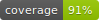

# Collaborative Task Management Application


## Live Web Link:
https://web-production-8986c.up.railway.app/api/houses/

A collaborative task management app for households to create, assign, and complete tasks. Integrated a point-based system to boost participation and accountability, with real-time task tracking. Designed to enhance productivity and promote teamwork in shared living spaces.

## Features

- **Django REST Framework (DRF):** For building robust and scalable APIs.
- **Google Cloud Integration:** Serving user files securely and efficiently.
- **JWT Authentication:** Ensuring secure access using JSON Web Tokens.
- **Google Login Support:** Simplified login process via Google OAuth.
- **Task Management:** Create, assign, and track tasks in real-time.
- **Point-Based System:** Gamified approach to boost member participation and accountability.
- **Team Collaboration:** Designed for households to foster teamwork and productivity.


## Default User Credentials

- **Superuser:**
  - Username: `admin`
  - Password: `admin`

- **Test User:**
  - Username: `test_user_5`
  - Password: `testuser123`

## API Endpoints

Registration:
```
api/accounts/users/
```

To Login:
```
api/auth/login/
```
To logout:
```
api/auth/logout/
```
Authentication:
```
/auth/
/auth/token/
/auth/token/refresh/
/auth/google/login/
```

Accounts:
```
/accounts/
```

To create new houses:
```
/houses/
```

To create new tasklists for a house:
```
/tasks/tasklist/
```
To create new task for a house:
```
/tasks/tasks
```

## Setup Instructions

1. Clone the repository:
   ```bash
   git clone https://github.com/ismailrazak/Collab-Task-api.git
   ```

2. Install dependencies:
   ```bash
   pip install -r requirements.txt
   ```


3. Run migrations:
   ```bash
   python manage.py migrate
   ```

4. Start the development server:
   ```bash
   python manage.py runserver
   ```
